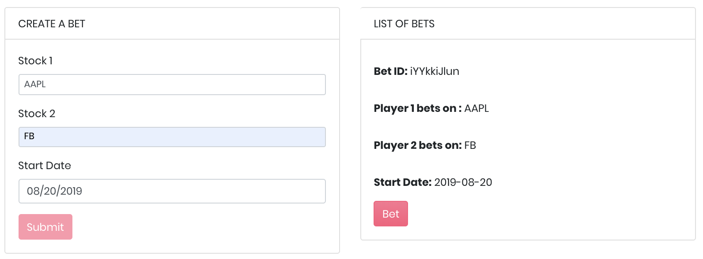
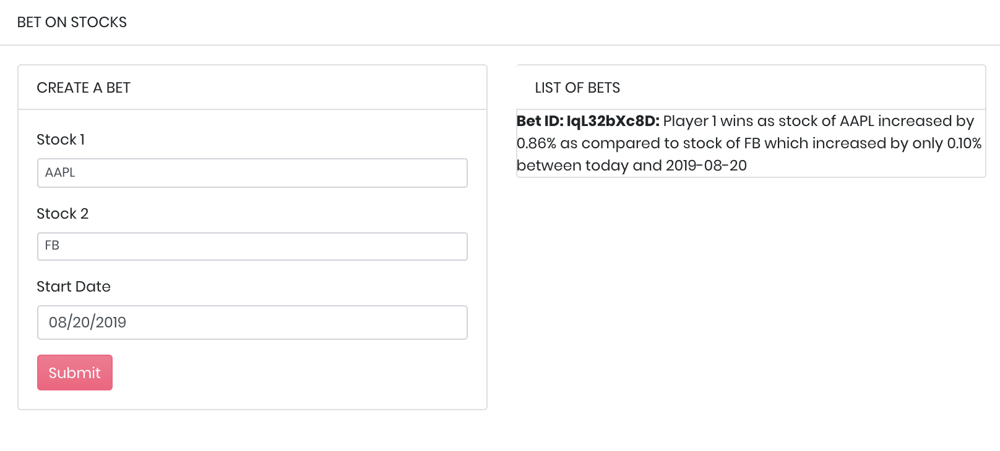

# StockBet
This is a demo dApp that allows two players to bet on two different stocks. The player who bets on the stock with the largest percentage increase between today and the provided start date, wins.

Furthermore, the dApp also displays the current top 4 stocks and their values.


```diff
- Make sure your Metamask account is up an running when you run this application. This is a demo App and does not cost any ZAP for running.
```

## How to run it
- In `oracles-files` directory, add your MetaMask mnemonic in Config.ts and run the following commands
  + `yarn`
  + `npm start`
Let it run in a separate terminal
- In `frontend-files` directory, run `npm start`
- Get the symbol list of stocks from here: https://financialmodelingprep.com/api/v3/company/stock/list
- Example Query:
 + Stock 1 = AAPL
 + Stock 2 = FB
 + Start Date = 2019-08-20
 

 - Result:
 

## APIs Used
- For getting the top 4 gainers: https://financialmodelingprep.com/api/v3/stock/gainers
- For getting daily time series of stock value for a particular company (e.g. AAPL):
https://www.alphavantage.co/query?function=TIME_SERIES_DAILY&symbol=AAPL&apikey=HWD38M52HGVY67RN
